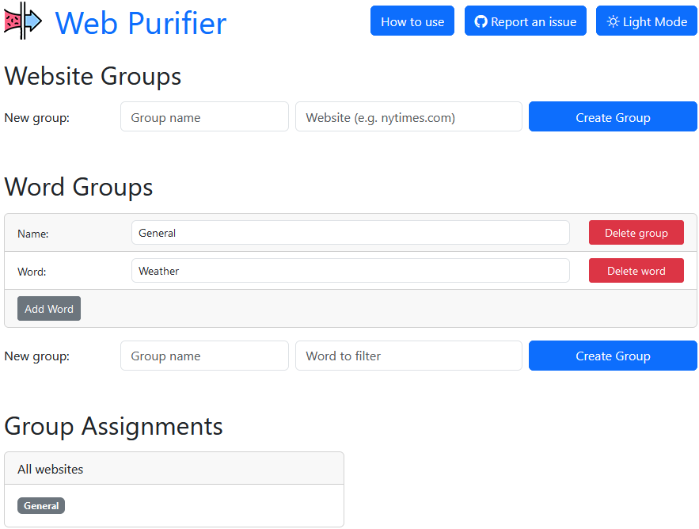

#  Web Purifier

> **Web Purifier hides page elements containing specified keywords, giving you control over the content you see online.**

## Features

- **Group-based** filtering that offers more flexibility than traditional content filterers
- Apply filters globally or to specific website groups
- Immediate hiding of filtered content on page load
- User-friendly no-scripting UI
- Dark theme option

**Example:** If you want to hide news articles that contain words spaghetti and mayonnaise, but only if they appear on NYTimes and BBC, you can do that with Web Purifier. 
 
## Installation

Or download it from [github releases](https://github.com/yourusername/web-purifier/releases/latest).

# Screenshots

## License

This project is licensed under the [MIT License](LICENSE).

## Support

If you found this extension useful, consider supporting the developer:

[Donation link to be included]
